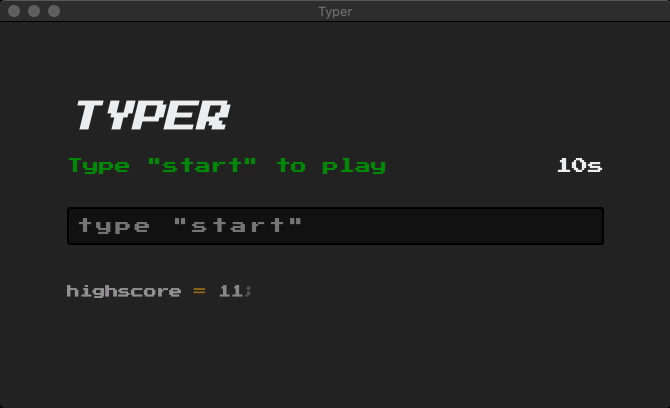

<h1 align="center"><a href="https://typerapp.now.sh/">⌨️ Typer</a></h1>

<p align="center">The 10-second typing game</p>

<p align="center">
  
  <a href="http://makeapullrequest.com/">
    
  </a>
  
  <a href="https://www.buymeacoffee.com/ninest">
    
  </a>
</p>

<p align="center"><a href="https://typerapp.now.sh/"></a></p>

## 🎮 How to play
1. Visit [https://typerapp.now.sh/](https://typerapp.now.sh/)
2. To start a game, type "start"

You now have **10 seconds** to type out all the words displayed. For every word you type correctly, your score increases, and you also get **1 extra second**. Can you beat my highscore of 16? (you probably can)

## 🚀 Features
- 10 seconds to type
  - Get an extra second for each word typed (small change of getting 2 seconds)
  - Randomly get a password field to spice the game up (1/6 chance)
- Save your highscore locally
- Save your highscore in the leaderboards to compete with others
  - leaderboards should reset every 2 weeks (not implemented yet)

## 🛠 Build setup
Clone or fork the repository, then run the commands to start the development server:

```
npm i
npm run dev
```

To build the app, run

```
npm run build
```

### Firebase
First go to the Firebase console and create a new project. In `src/scripts/`, add `firebase.js` and paste the following:

```js
import firebase from 'firebase/app';

const firebaseConfig = {
  apiKey: '',
  authDomain: '',
  databaseURL: '',
  projectId: '',
  storageBucket: '',
  messagingSenderId: '',
  appId: '',
  measurementId: ''
};

export const app = firebase.initializeApp(firebaseConfig);

firebase.auth().signInAnonymously().then(() => {
  console.log('anonymous sign in successful');
}).catch((err) => {
  console.log('error in sign in: ', err);
});
```

Fill up your details accordingly. Find these details on the Firebase console.

After this, go to the "Authentication" tab and enable anonymous sign in. Authentication is required to read and write the database.

### Encryption
In `src/scripts/`, create `keys.js` with the following:

```js
export const key = 'a secret key';
```

Here's one way to generate a ranom string:

```python
# python
from base64 import b64encode
from os import urandom

random_bytes = urandom(32)
secret = b64encode(random_bytes).decode('utf-8')

print(secret)
```

### Hosting

The game is hosted with Vercel. To host a debug version of the app, run

```
now
```

To host the production version of the app, run

```
now --prod
```

## ♥️ Support
If you liked this project, consider supporting by
- ⭐️ Starring the repository
- 🎒 Checking out my other [projects](https://github.com/ninest)
- ☕️ Buying me [coffee](https://www.buymeacoffee.com/ninest)

## 📜 License
MIT